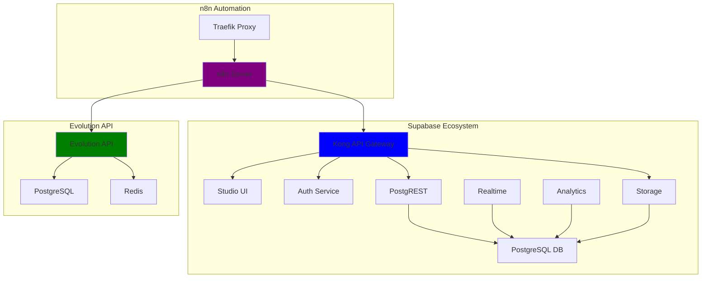
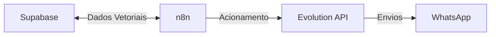
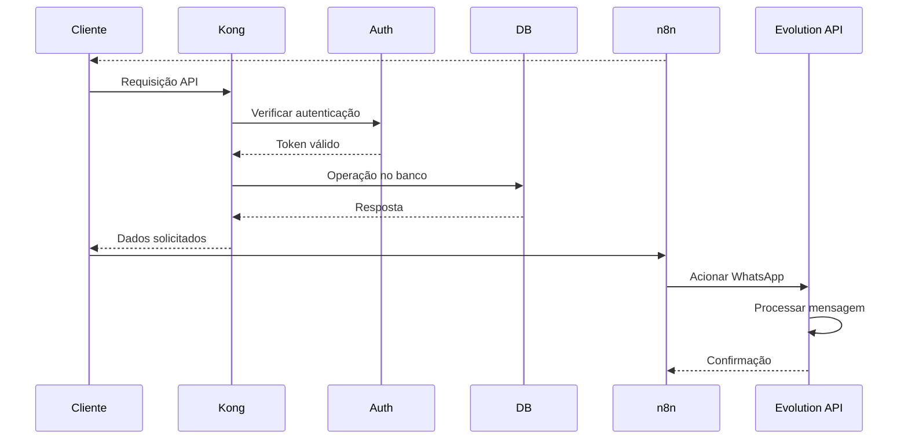

# Projeto Supabase + n8n + Evolution API

Este projeto integra três plataformas poderosas em uma infraestrutura Docker:

- **Supabase**: Backend-as-a-Service com banco de dados PostgreSQL e serviços extras.
- **n8n**: Automação de workflows com interface visual.
- **Evolution API**: Integração com WhatsApp para envio e recebimento de mensagens.

---

## Arquitetura do Sistema



---

## Serviços Principais

### 1. Supabase (Backend-as-a-Service)

| Serviço  | Função                                  | Porta  |
|----------|----------------------------------------|-------|
| Studio   | Interface web de administração          | 3000  |
| Kong     | API Gateway e gerenciamento de APIs     | 8000/8443 |
| Auth     | Sistema de autenticação (Gotrue)       | 9999  |
| Rest     | API REST (PostgREST)                    | 3000  |
| Realtime | Websockets para atualizações em tempo real | 4000 |
| Storage  | Sistema de armazenamento de arquivos    | 5000  |
| Meta     | Gerenciamento de metadados do PostgreSQL | 8080 |
| DB       | Banco de dados PostgreSQL principal     | 5432  |
| Analytics| Sistema de análise de logs (Logflare)  | 4000  |

### 2. n8n (Automação de Workflows)

| Serviço | Função                               | Porta  |
|---------|-------------------------------------|-------|
| Traefik | Reverse proxy e SSL                  | 80/443 |
| n8n     | Plataforma principal de automação   | 5678  |

### 3. Evolution API (API do WhatsApp)

| Serviço  | Função                       | Porta |
|----------|-----------------------------|-------|
| API      | API principal do Evolution   | 5521  |
| Postgres | Banco de dados do Evolution  | 5432  |
| Redis    | Cache e sessões              | 6380  |

---

## Fluxo de Dados



---

## Como Executar

1. Clone o repositório:

```bash
git clone <URL_DO_REPOSITORIO>
cd seu-projeto
```

2. Configure as variáveis de ambiente no arquivo `.env`.

3. Suba todos os serviços:

```bash
docker-compose up -d
```

4. Acesse:

- Supabase Studio: [http://localhost:3000](http://localhost:3000)
- n8n: `https://seu-subdomínio.seu-dominio.com`
- Evolution API: [http://localhost:5521](http://localhost:5521)

---

## Variáveis de Ambiente Principais

| Variável            | Descrição                           |
|---------------------|------------------------------------|
| POSTGRES_PASSWORD   | Senha do PostgreSQL                |
| JWT_SECRET          | Segredo para tokens JWT            |
| SUPABASE_PUBLIC_URL | URL pública do Supabase            |
| DOMAIN_NAME         | Domínio principal para acesso      |
| SUBDOMAIN           | Subdomínio para o n8n              |
| SSL_EMAIL           | E-mail para certificados SSL       |

---

## Considerações de Segurança

- Todas as comunicações são protegidas com SSL via Traefik
- Sistema de autenticação JWT integrado
- Controle de acesso por roles do PostgreSQL
- Ambiente isolado em rede Docker privada

---

## Comandos Úteis

```bash
# Iniciar todos os serviços
docker-compose up -d

# Parar todos os serviços
docker-compose down

# Ver logs
docker-compose logs -f

# Ver status dos containers
docker-compose ps

# Fazer backup dos volumes
docker-compose stop
tar -czvf backup.tar.gz volumes/
```


## Diagrama de Sequência

